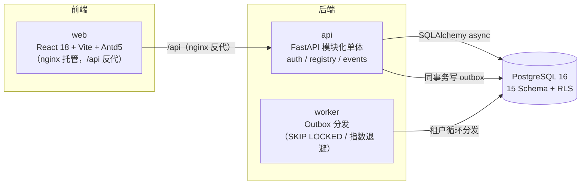

# EDP 数据平台

企业数据平台（EDP）W1 交付：多租户业务对象登记 / 事件入库 / Outbox 分发的后端服务 + 契约驱动的 EDP 控制台前端基座。
单仓双工作区：`backend/`（uv workspace）+ `frontend/`（pnpm workspace）+ `contracts/`（API 契约中立场）。

## 架构



## 快速开始（Docker Compose 全套）

前置：Docker（含 compose v2）。

```powershell
# 1. 起全套（db / api / worker / web）
docker compose -f deploy/docker-compose.dev.yml up -d --build

# 2. 跑数据库迁移（15 Schema 基线 + RLS + 种子数据；先 up 后 migrate，worker 会自动恢复）
sh deploy/migrate.sh        # Git Bash / WSL；PowerShell 等效见下表

# 3. 冒烟验证
curl http://localhost:8000/healthz          # {"status":"ok"}
start http://localhost:5173                  # 浏览器打开登录页
```

宿主 5432/8000 被占用时，叠加 override 映射到 15432/18000/9080：

```powershell
docker compose -f deploy/docker-compose.dev.yml -f deploy/docker-compose.dev.override.yml up -d --build
sh deploy/migrate.sh   # 迁移走 compose 内网，无需 override；PowerShell 等效：
docker compose -f deploy/docker-compose.dev.yml run --rm --no-deps `
  -e EDP_DATABASE_URL="postgresql+asyncpg://edp_migrator:edp_dev@db:5432/edp" `
  api alembic upgrade head
```

### 种子凭据（dev/CI 专用；prod 由 `EDP_ADMIN_INITIAL_PASSWORD` / `EDP_DEV_API_KEY` 强制覆盖）

| 凭据 | 值 | 说明 |
|---|---|---|
| 管理员 | `admin` / `Admin@123!` | 平台管理员（is_platform_admin），租户 `default` |
| 演示用户 | `manager1` / `Admin@123!` | MANAGER 角色 |
| 演示用户 | `analyst1` / `Admin@123!` | ANALYST 角色 |
| API Key | `X-API-Key: edp-dev-agent-hub-key` | 服务主体 `agent-hub`，scopes：readonly / write:event / write:registry |

### 常用端口

| 服务 | 默认映射 | override 映射 | 说明 |
|---|---|---|---|
| db | 5432 | 15432 | `edp_migrator:edp_dev`（迁移）/ `edp_app`（应用，受 RLS） |
| api | 8000 | 18000 | uvicorn，`/healthz` + `/api/v1/*` |
| web | 5173 | 9080 | nginx：SPA 静态 + `/api` 同源反代 |

### MSW 模式（前端脱离后端开发）

`pnpm --filter web dev` 默认直连 `http://localhost:8000`（或构建期 `VITE_API_BASE`）；
设置 `VITE_USE_MSW=1` 启用浏览器 Service Worker 拦截（`src/mocks/`），无需后端即可走查登录/壳层。
web 容器构建时 `VITE_API_BASE` 显式置空 = 同源相对路径，经 nginx `/api` 反代到 api 服务。

## 常用命令（Makefile 目标 → PowerShell 等效）

| Make 目标 | PowerShell 等效 |
|---|---|
| `make backend-lint` | `cd backend; uv run ruff check .; uv run lint-imports` |
| `make backend-test` | `cd backend; uv run pytest` |
| `make backend-isolation` | `cd backend; uv run pytest tests/integration/test_tenant_isolation.py -q` |
| `make backend-migrate-check` | `cd backend; uv run alembic upgrade head; uv run alembic downgrade base; uv run alembic upgrade head` |
| `make contract-export` | `cd backend; uv run python scripts/export_openapi.py` |
| `make contract-gate` | `cd frontend; node scripts/check-contract-fingerprint.mjs` |
| `make frontend-lint` | `cd frontend; pnpm -r lint` |
| `make frontend-test` | `cd frontend; pnpm -r test` |
| `make verify-all` | 依次执行上述全部 |

前端另有：`pnpm -r build`（含 tsc --noEmit）、`pnpm --filter web build-storybook`、`pnpm --filter web dev`、`pnpm --filter api-sdk gen`（契约 → SDK 重生成）。

## 目录结构

```
backend/                  uv workspace 根
  apps/api/               FastAPI 服务（edp_api：core + modules/{auth,tenantmgmt,platform,registry,events}）
  apps/worker/            Outbox Worker（edp_worker）
  packages/adapters/      源系统适配器基座（edp_adapters）
  migrations/             Alembic（versions/{platform,master,event,misc}，0001~0007）
  tests/{unit,integration}/  pytest（integration = testcontainers 真 PG）
frontend/                 pnpm workspace 根
  apps/web/               EDP 控制台（Vite + Antd5 + Tailwind v4 + Storybook）
  packages/shared/        令牌/9 核心组件（框架无关）
  packages/api-sdk/       openapi-typescript 生成的 SDK + client/interceptors
  scripts/                契约指纹门禁脚本
contracts/                OpenAPI 快照（openapi.json + sha256）与变更流程 → 见 contracts/README.md
deploy/                   docker-compose.dev.yml（+ 本地端口 override）、migrate.sh、pg-init/
.github/workflows/        backend.yml / frontend.yml（含 migrate-check 与契约双门禁）
```

## 契约流程

契约冻结基线与变更评审流程（PR + Tech Lead 评审 + SDK 重生成三联动）见 [contracts/README.md](contracts/README.md)。
后端契约漂移 → `contract-export --check` / CI `contract-gate` 失败；SDK 指纹不符 → 前端 `check-contract-fingerprint.mjs` 失败。

## W1 交付清单（14 任务对照）

| 任务 | 状态 | 一行摘要 |
|---|---|---|
| EDP-001 | ✅ | 双工作区脚手架、ruff/import-linter、GitHub Actions、compose（api/worker/db/web） |
| EDP-002 | ✅ | Alembic 基线：15 Schema DDL + RLS + edp_migrator/edp_app 角色 + 种子数据（0001~0007） |
| EDP-003 | ✅ | JWT（Argon2id）+ API Key 双轨认证、RBAC 矩阵、login/refresh/me |
| EDP-004 | ✅ | Registry API：upsert（乐观锁 409）、组合键查询、history |
| EDP-005 | ✅ | Events API：批量入库（UUIDv5 幂等）、Idempotency-Key 重放去重、查询 |
| EDP-006 | ✅ | Outbox 写侧 + Worker：SKIP LOCKED、指数退避、按租户循环、异常隔离 |
| EDP-007 | ✅ | OpenAPI 导出冻结：contracts/ 快照 + sha256 指纹 + 变更评审流程 |
| EDP-022 | ✅ | 租户数据模型与 RLS：跨租户隔离矩阵用例进 CI（A 读写 B → 0 行/404/403） |
| EDP-023 | ✅ | 租户上下文中间件：JWT/API Key 绑定、SET LOCAL、租户状态守卫 |
| EDP-101 | ✅ | 前端 pnpm workspace：Vite + 路由装配 + CI 接入 |
| EDP-102 | ✅ | Antd Token 主题映射（--edp-* 令牌）+ 暗色模式记忆 + Storybook 基线 |
| EDP-103 | ✅ | 壳层骨架：四组导航/顶栏/面包屑/租户切换器（静态）/登录页/路由守卫 |
| EDP-104 | ✅ | 9 核心组件（Pill/Chips/KPI/时间线/模态/空态/危险确认/MonoId/游标分页）+ 三状态 Story |
| EDP-105 | ✅ | api-sdk 自动生成管线 + 契约双门禁 CI（指纹不符 PR 失败，已演练） |

W1 全量验证基线：后端 `ruff` / `lint-imports` / `pytest` 159 passed（unit + testcontainers integration）；
前端 `pnpm -r lint` / `test` 112 passed / `build` / `build-storybook` / 契约指纹门禁全绿；
compose 全栈（db/api/worker/web）起 + 迁移 + 登录/对象/事件/幂等重放/worker 分发/web 反代冒烟通过。

任务原文与验收标准见 `EDP数据平台开发计划_一阶段.md`（上游文档，本 README 仅作交付对照，不改动其正文）。
