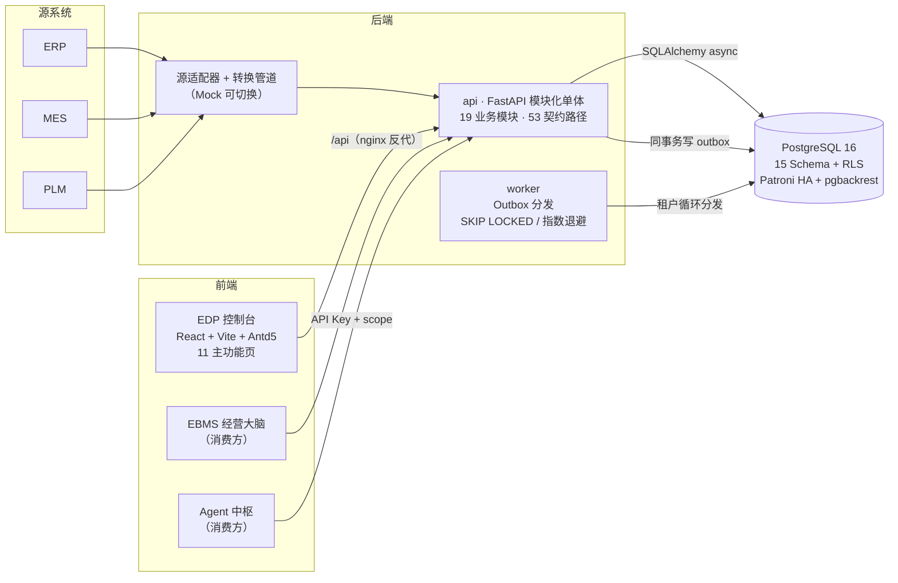

# EDP 数据平台 · 能力讲解（W1~W4 交付全景）

> 用途：面向客户 / 合作方的平台能力讲解与演示配套材料。
> 范围：一阶段 6 周计划的前 4 周（W1~W4，里程碑 M1~M4）已交付内容 + W5/W6 展望。
> 数据口径：2026-09-18，全部数字来自仓库实测记录（测试运行 / 演示脚本 / 演练记录）。

---

## 1. 一页看懂 EDP

**EDP（Enterprise Data Platform）是企业数据与证据平台**——为 AI 自治能力（订单风险、订单质量、产品就绪度等）提供可信的数据供给，为每一个 AI 结论留下可验证的证据链，并让人工始终掌握关键决策的审批权。

三句话讲清价值：

1. **数据可信**：源系统数据经适配器接入、转换、落库，每条数据带快照证据与校验和，篡改可被即时探测；
2. **结论可溯**：从"AI 风险结论"可以一路逆向追溯到底层源记录，四层证据链一屏呈现；
3. **人机协作**：决策与关键行动步骤仅限人工执行（Human-Only），AI 越权尝试被强制拦截并留审计痕——**AI 越权执行 = 0**。

### 交付概览（截至 W4 收口）

| 维度 | 数字 |
|---|---|
| 开发周期 | 4 周（W1~W4），78 次提交 |
| 后端业务模块 | 19 个（认证 / 租户 / 对象登记 / 事件 / 证据 / 审计 / 决策 / 行动 / EBMS / Agent 工具 / Trace / Memory…） |
| 数据库 | PostgreSQL 16 · 15 Schema · 行级安全（RLS）· 12 个版本化迁移 |
| API 契约 | OpenAPI 3.1 · 53 路径 · 指纹冻结（sha256 门禁） |
| 自动化测试 | 后端 618 通过（含 testcontainers 真 PG 集成）· 前端 302 通过 |
| 安全验证 | 越权矩阵 41 用例（角色 × 租户 × 资源全组合）0 泄露，CI 常驻 |
| 控制台页面 | 11 个主功能页 + 登录（运营总览 / 业务对象 / 事件流 / 证据库 / 数据质量 / 系统健康 / 审计日志 / 适配器管理 / 闭环案例 / 决策审批 / 行动） |
| 高可用 | staging 双节点 Patroni 拓扑，主从切换演练 2/2 成功，应用探测 40/40 零中断 |
| 端到端验收 | M4 闭环演示 5 幂脚本 + 6 条集成验收用例，可随时回归 |

---

## 2. 平台架构



工程要点：

- **单仓双工作区**：`backend/`（uv workspace）+ `frontend/`（pnpm workspace）+ `contracts/`（API 契约中立场）；
- **契约驱动**：后端 OpenAPI 快照冻结在 `contracts/`（sha256 指纹），前端 SDK 由契约自动生成，双侧指纹门禁进 CI——契约不一致的 PR 无法合并；
- **测试基线**：后端单元 + testcontainers 真 PG 集成测试；前端 Vitest + Storybook；迁移在 CI 实跑（upgrade → downgrade → upgrade 全周期）；
- **MSW 双轨开发**：前端可在无后端环境下基于 Mock 完成页面开发与演示保底。

---

## 3. 四周交付旅程（M1~M4）

| 里程碑 | 周 | 主题 | 交付要点 |
|---|---|---|---|
| **M1** | W1 | 契约冻结 | 15 Schema DDL + RLS 基线；JWT/API Key 双轨认证与 RBAC 矩阵；对象登记 / 事件入库 / Outbox 分发骨架；契约快照 + SDK 生成管线 + 双门禁 CI；跨租户隔离用例进 CI |
| **M2** | W2 | 数据链路 | ERP Mock 适配器 + 转换管道（全量/增量、幂等、0 偏差对账）；证据存储与 **checksum 篡改探测**；审计切面全写操作留痕；租户开通→暂停→恢复→注销全生命周期 |
| **M3** | W3 | 能力数据就绪 | Agent 数据工具 API 六接口（Read-Only 三层纵深）；能力结果回流（风险字段 + 证据关联 + 案例自动创建）；EBMS 查询 API；Trace / Memory / 注册中心；十类评估场景演示数据一键 seed + 重放；限流与配额 |
| **M4** | W4 | **端到端闭环（关键路径）** | 闭环案例聚合 API；Action 9 态状态机（Human-Only 转移）；审计策略 API；越权矩阵 41 用例；控制台四页（闭环案例 / 决策审批 / 行动 / 审计日志）+ 适配器管理页；staging HA 拓扑 + 切换演练；7 分钟闭环演示脚本实测走通 |

每周出口条件均有"测试 + 演示脚本 + 实测读数"三级证据，收口记录归档在仓库内。

---

## 4. 核心能力详解（按演示价值组织）

### 4.1 数据接入与对象登记

- **适配器 + 转换管道**：ERP / MES / PLM 以适配器端口接入（当前为 Mock 实现，真实接口到位仅改配置），源记录 → 三元组（对象 / 事件 / 证据）单事务落库；
- **增量水位与幂等**：全量 + 增量混合回放 0 重复、对象 revision 递增正确；对账任务源-库三计数齐等（0 偏差）；
- **乐观锁并发安全**：并发 upsert 同一对象时，恰一个成功、另一个收到 409 + 当前版本号。

### 4.2 事件与证据：篡改可探测、结论可追溯

- **事件批量入库**：UUIDv5 内容寻址幂等 + Idempotency-Key 重放去重（重放零重复行）；
- **证据快照 + 校验和**：每条证据落库时计算 canonical checksum；`verify` 接口重算比对——现场演示中直接在数据库层篡改 snapshot 后，verify 立即返回失效并写 P1 审计告警；
- **四层证据链**：`RESULT（AI 结论）→ DECISION（人工决策）→ EVIDENCE（过程证据）→ SOURCE（源记录）`，任一节点可即时校验、可逆向追溯。

### 4.3 Agent 数据供给（Read-Only 纵深）

- **工具 API 六接口**：订单 / 库存 / 采购 / BOM / 供应商交期 / 客户，全部只读，返回自带 `evidence_hint` 指向证据行——AI 的每个取数动作都能对应到可验证的数据出处；
- **三层纵深防护**：非 GET → 405；scope 不足的 API Key → 403 + GUARD_DENIED 审计；RLS 数据层兜底；
- **Trace 全留痕**：Agent 每次执行一条 trace + N 条 tool_calls（含 token 用量），Memory 候选可沉淀并经人工评审流转。

### 4.4 决策与行动闭环（M4 核心）

从风险识别到行动验证的完整闭环，7 分钟可演示：

```
事件回流（AI 风险结论 P1）
  → 案例自动创建（OPEN）
  → 人工审批决策（Human-Only，AI 提交 → 403 + 审计）
  → 行动创建（PROPOSED）
  → 9 态状态机推进：ASSIGNED → ACCEPTED → APPROVED → EXECUTING → COMPLETED → VERIFIED
  → 每步意见自动落证据链（checksum 保护）
  → action.verified 事件回流，总览 KPI 更新，待办清零
```

- **9 态状态机**：非法转移返回 422 并附 `allowed_to`（前端按钮组据此重渲染）；并发双审批仅一成功（409 + 友好文案）；
- **Human-Only 守卫**：决策提交、EXECUTING / VERIFIED 推进等关键边仅限人工；SERVICE 身份（AI）尝试即 403 GUARD_POLICY_DENIED + 独立会话审计行——这是"AI 越权执行 = 0"的直接举证；
- **闭环案例聚合**：`/decisions/cases/{id}` 单次响应组装完整闭环叙事——源事件摘要、Steps 时间线（Human-Only 节点带人形标识）、四层证据链、关联行动卡。

### 4.5 多租户与安全

- **行级隔离（RLS）**：全业务表带 tenant_id，数据库层强制隔离；跨租户读写实测 0 行泄露；
- **双轨认证**：人工走 JWT（Argon2id 密码哈希），服务走 API Key（scope + 租户绑定）；
- **RBAC 权限矩阵**：角色 → 权限码集中管理，前端共享同一份权限包；
- **越权矩阵测试**：41 个参数化用例（角色 × 租户 × 资源全组合，含 RLS 直查）进 CI 常驻，任何回归即刻暴露；
- **审计不可抵赖**：全部写操作切面留痕（before/after），审计表仅追加；GUARD_DENIED / 篡改探测 / 限流告警均有独立审计行，支持策略化打标与导出。

### 4.6 可靠性（staging 实测）

| 演练项 | 实测结果（2026-09-18） |
|---|---|
| Patroni 主从切换 | 双向往返 2/2 成功，集群秒级收敛 |
| 应用可用性 | 切换期间 `/healthz` 连续探测 40 次全部 200，零中断 |
| 复制延迟 | 切换后 replica 立即恢复 streaming，replay_lag 3.2ms |
| 备份 | 全量备份 32.3MB / 1565 文件 / 8.5 秒完成；WAL 归档自 timeline 1 起连续 |
| 回滚 | 应用层按版本镜像回滚实测可用 |

### 4.7 工程化与质量门禁

- 契约冻结 + 指纹双门禁（后端导出 vs 快照、SDK vs 指纹）；
- 后端 618 / 前端 302 自动化测试全绿，集成测试跑在真实 PG（testcontainers）；
- M4 闭环 6 条端到端验收用例（全链闭环 / Human-Only 403 / 非法转移 422 / 并发 409 / EBMS 口径 / 聚合完整性）随时回归。

---

## 5. 控制台一览（11 主功能页）

| 分组 | 页面 | 亮点 |
|---|---|---|
| 总览 | 运营总览 | Hero 状态卡 + 8 KPI + 风险抽屉（420px，时间线 + 关联证据）+ 三栏图表，30s 轮询 |
| 工作台 | 业务对象 | 卡片/表格双视图、筛选 chip、revision 历史、新建弹窗 |
| 工作台 | 事件流 | KPI 带、游标分页（总数文案）、事件详情抽屉、回放三步向导 |
| 工作台 | 证据库 | 双栏列表 + 证据链图、verify 即时校验联动、重索引向导、卡内搜索 |
| 运维 | 数据质量 | 维度评分、异常卡（对接风险事件）、重校验弹窗、任务日志抽屉 |
| 运维 | 系统健康 | HA / 备份 / Outbox / 告警四卡 + 演练入口，10s 深层轮询 |
| 运维 | 适配器管理 | 7 列清单、三弹窗（新增/测试连接/连接向导可回退）、同步日志抽屉 |
| 审计 | 审计日志 | 五参筛选 + chips、GUARD_DENIED 高亮、CSV 导出（Excel 兼容 BOM）、策略管理 tab |
| 闭环 | 闭环案例 + 详情 | 一屏四区：问题卡 / 证据链横向图（节点可校验）/ Steps 时间线（Human-Only 人形图标）/ 关联行动卡 |
| 闭环 | 决策审批 | 待决角标、Human-Only 表单、AI 越权 403 文案逐字对齐设计规范 |
| 闭环 | 行动 | 9 态状态轴可视化（已走路径高亮）、allowed_to 按钮组驱动、409/422 冲突文案 |

另含登录页 / 路由守卫 / 403/404 兜底 / 暗色模式；9 个框架无关核心组件（状态 Pill / KPI 卡 / 时间线 / 危险确认 / Mono 短 ID / 游标分页等）沉淀在共享包并有 Storybook 三状态基线。

---

## 6. 七分钟闭环演示动线（M4 实测脚本）

演示场景：**订单 B（SO-2026-00123）关键料缺失**——物料 X 缺口 1000、供应商交期 10 天、预计延误 5 天。

| 幕 | 时长 | 讲解点 |
|---|---|---|
| ① 总览开场 | 1min | KPI 六卡（24H 事件 / P95 延迟 / 幂等命中率 / 证据量等）+ P1 风险列表，订单 B 在列且已关联案例 |
| ② 风险下钻 | 1.5min | 风险抽屉 → 事件详情 → RESULT 证据逆向追溯到源快照 |
| ③ 证据链一屏 | 2min | 案例详情四区；证据链分层计数；任一节点 verify 即时校验通过 |
| ④ HITL 审批 + 行动闭环 | 1.5min | AI 提交决策被拦（403 + 审计行举证）→ 人工审批 → 行动六步推进至 VERIFIED，每步意见落证据链；非法转移 422 / 并发 409 现场演示 |
| ⑤ 回流收口 | 1min | action.verified 事件回流（幂等重放演示）→ 待办清零、KPI 变化、经营简报更新 |

三轮对比读数是天然讲解点：案例 steps 2 → 5 节点、证据链三层 → 四层、对象证据 2 → 6 条——"证据链随闭环生长"。

> 演示执行细节（环境启动、种子数据、逐步命令与预期读数）见内部脚本 `docs/demo/m4-demo.md`，支持一键 seed + RESET 重放。

---

## 7. 后续展望（W5~W6，一阶段收尾）

| 周 | 主题 | 计划内容 |
|---|---|---|
| W5 | 可靠性与安全达标 | Patroni 生产上线 + 三项演练全记录（切换 / PITR 时间点恢复 / 租户级恢复）；数据质量任务与覆盖率周报；备份调度与每日可恢复性验证；租户管理页 / 演练回放页 / Agent 三页 |
| W6 | 试运行与 Go/No-Go | 性能压测（主要接口 P95 < 2s）与索引治理；运营报告一键导出（覆盖率 / 追溯率 / 闭环率 / 越权 / 审计完整率）；Playwright E2E（闭环 + 多租户隔离）；视觉回归基线；试运行 ≥3 天无 P0/P1 后验收 |

一阶段验收指标（门槛）：业务对象覆盖度 ≥95%、P0/P1 证据可追溯率 100%、重大风险召回率 ≥80%、Action 闭环率 ≥90%、AI 越权执行 = 0、租户隔离 100% 拒绝、RTO < 5min。

---

## 8. 附录：可引用的硬数据

- 演示数据集：十类评估场景，一键 seed（43 条源快照 + 10 条能力回流事件，支持 RESET 重放）；
- 契约冻结：53 路径，指纹前 8 位 `687b6cd7`（变更需 PR + 评审 + SDK 重生成三联动）；
- 测试：backend 618 passed（unit + integration）/ frontend 302 passed（web 184 + sdk 22 + shared 96）；
- 安全：越权矩阵 41 用例 0 泄露；M4 验收 6 用例；
- HA：switchover 2/2、`/healthz` 40/40、replay_lag 3.2ms、全量备份 32.3MB / 8.5s；
- 工程节奏：4 周 / 78 提交 / 每里程碑收口记录 + 缺口台账归档。
